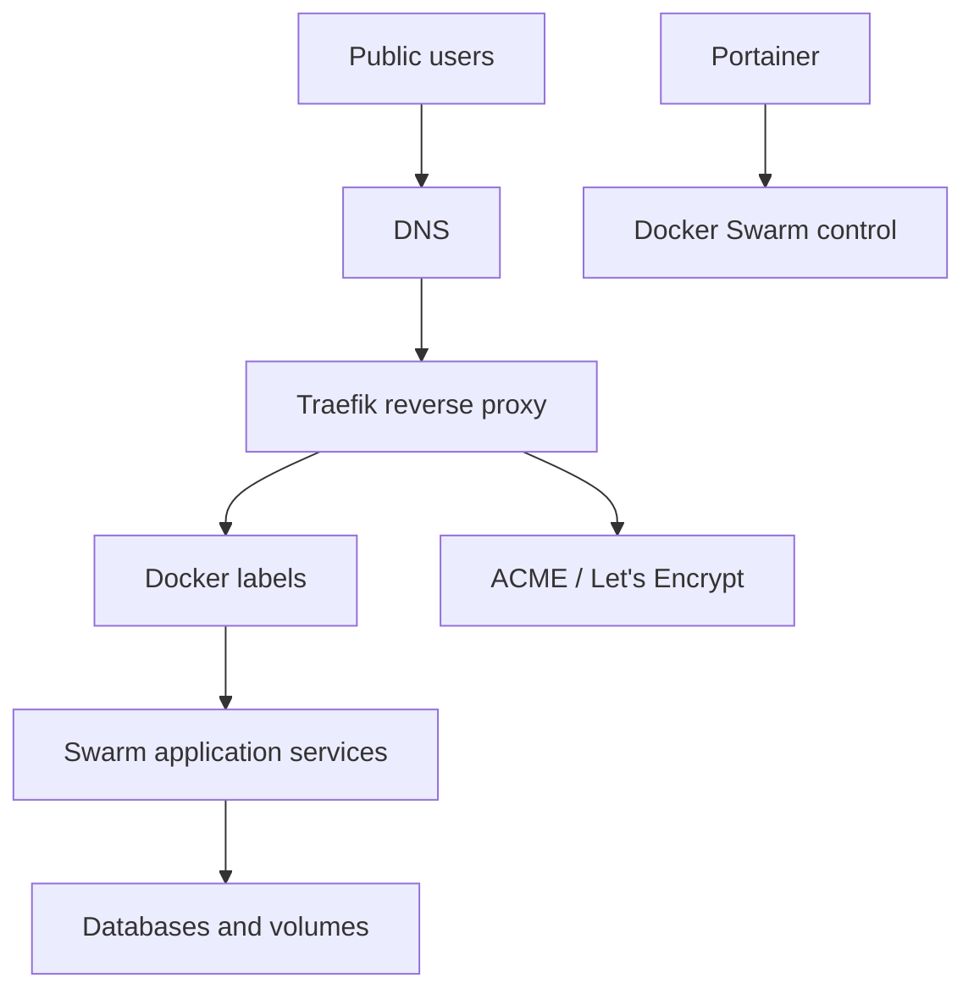

# Architecture

## Executive Summary

This repository documents the original Docker Swarm infrastructure phase. Application stacks run as Swarm services and expose public routes through Traefik labels on a shared overlay network.

The architecture is dynamic: Traefik watches Docker metadata, discovers routers, applies middlewares, and issues ACME certificates. This is powerful because each app can declare its own route close to its stack definition.

## Platform Layers



## Core Components

| Component | Responsibility |
| --- | --- |
| Traefik | public edge, routing, TLS, dashboard, middlewares |
| Docker Swarm | service scheduler, overlay networking, stack deployment |
| Portainer | visual operations surface for stacks and services |
| MySQL stacks | production and development database environments |
| Mongo stack | MongoDB and Mongo Express |
| Passbolt stack | password manager and MariaDB |
| Superset stack | BI service with custom image |
| Jenkins stack | CI/CD control service |
| GLPI stack | IT service management |
| WordPress apps | shared image and per-site stack files |
| Cleanup stack | helper for Docker cleanup tasks |

## Network Model

The main shared edge network is:

```text
edge-net
```

Services that need public routing attach to this overlay network. Traefik also attaches to it, allowing it to reach routed services by Swarm DNS names.

## Dynamic Routing Model

Each app stack can declare labels such as:

```text
traefik.enable=true
traefik.http.routers.<name>.rule=Host(...)
traefik.http.routers.<name>.tls.certresolver=letsencrypt
```

Benefits:

- route config stays close to the service.
- new services can be added without editing a central route file.
- Traefik reloads dynamically from Docker events.
- ACME integration is built in.

Tradeoffs:

- route behavior is spread across many stack files.
- label mistakes are easy to miss.
- dashboard/debugging is required to understand the active route graph.
- dynamic behavior is harder to present and audit than a central Nginx route file.

## State Model

State lives in:

- Docker volumes.
- database containers.
- Docker secrets.
- app-specific config files.
- Traefik ACME storage.

The repo intentionally commits only templates and references. Real runtime state remains outside Git.

## Evolution Path

This repo is phase one:

```text
Traefik + Swarm -> Nginx + Swarm edge -> K3s platform lab
```

It remains valuable because it shows the original dependencies, deployment order, and operating assumptions that the later Nginx and K3s repos improve.

