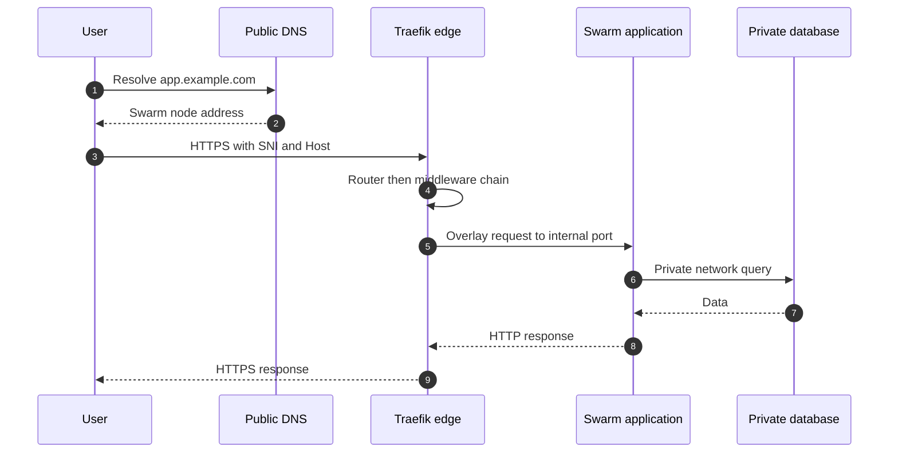
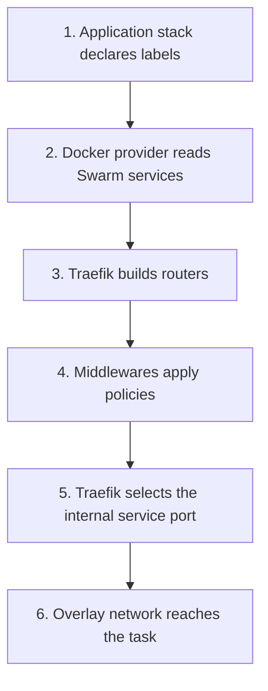
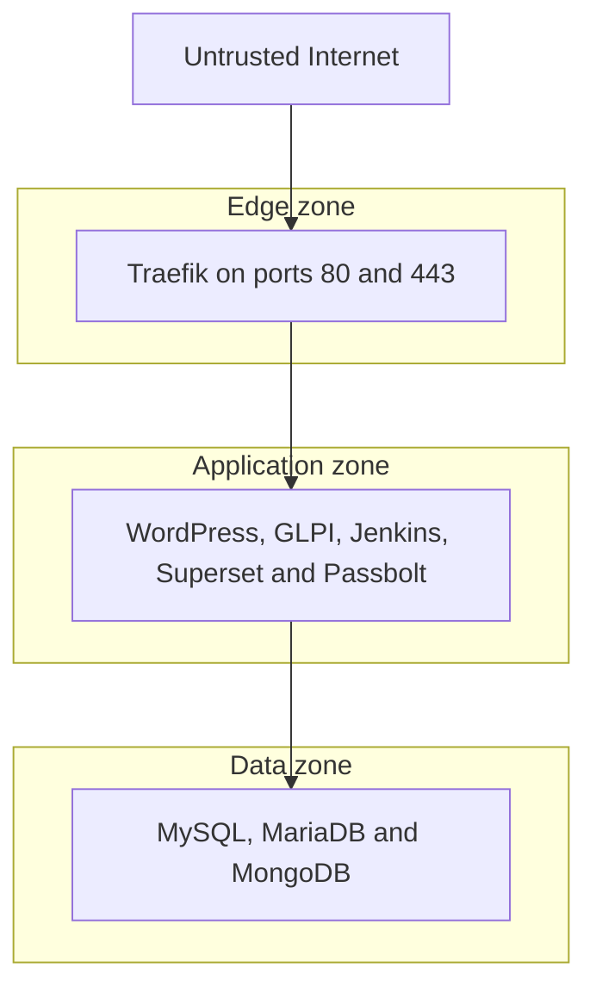

# Architecture diagrams

The diagrams are deliberately linear. Detailed route mappings live in tables so connectors never obscure nodes.

## Request path

## Dynamic configuration path

## Trust zones

